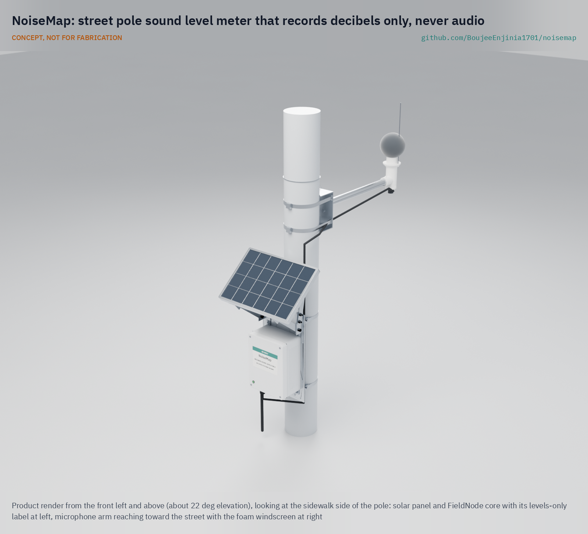

# NoiseMap

     

**Area:** Smart Cities · **TRL:** 3 of 9 (proof of concept on paper) · **Value-engineering target:** $100 USD for the NoiseMap parts, estimated $72 (FieldNode core costed separately) · **Difficulty:** 2 of 5

A sound level meter node that records decibel levels only, never audio, to map traffic and nightlife noise.

[Exploded render](media/render-exploded.png) · [Detail render](media/render-detail.png) · [Interactive 3D model](media/viewer.html) · [Concept blueprint (PDF)](media/concept-blueprint.pdf) · [General arrangement NSM-DWG-001 (PDF)](cad/drawings/NSM-DWG-001.pdf) · [Calculations NSM-CAL-001](docs/04-calcs/01-sizing.md) · [Prototype build plan](docs/05-build-plan.md) · [Design decisions](docs/06-design-decisions.md) · [Review note](docs/REVIEW.md)

## Concept rationale

Most noise disputes turn on one question: how loud was it, and when? A sound level meter answers that with a few numbers per second; it does not need to keep any sound. NoiseMap puts a digital MEMS microphone and a small processor in a head about 4 m above the street, turns the sound into A- and C-weighted levels on the spot, and passes only those levels to the lab's standard FieldNode solar and LoRaWAN core. The head firmware sends levels only, and it is open and published with a build hash, so residents, venues and the city can check for themselves that the street is not being listened to.

It is open and garage-buildable because the people who most need the evidence, residents' groups and small city noise teams, cannot buy certified monitoring terminals by the dozen. A MEMS microphone, a microcontroller board, a printed housing, a foam windscreen, an arm and a street pole adapter cost about $72 on top of the FieldNode core, and the open firmware lets anyone check that the node measures levels and nothing else.

## Burning platform

Noise is one of the largest environmental health burdens in cities. In the EU about 92 million people are exposed to harmful road traffic noise, and long-term transport noise is linked to about 66,000 premature deaths and about 50,000 new cases of cardiovascular disease a year ([EEA](https://www.eea.europa.eu/en/topics/in-depth/noise)). The WHO recommends keeping road traffic noise below 53 dB Lden and 45 dB Lnight ([EEA, citing WHO 2018](https://www.eea.europa.eu/publications/health-risks-caused-by-environmental)), stricter than the 55 dB Lden threshold used for EU reporting.

Yet official noise maps are mostly modeled and, in the EU, reviewed only every five years ([Directive 2002/49/EC](https://eur-lex.europa.eu/legal-content/EN/TXT/HTML/?uri=CELEX:32002L0049)), while complaints pile up without measurements behind them. By 2018 New York City's 311 line had logged more than 2.3 million noise complaints since 2010, more than for any other issue ([Bello et al., *Communications of the ACM*, 2018](https://arxiv.org/pdf/1805.00889)).

## Where it could be used

### By industry

| Industry | Use |
| --- | --- |
| Municipal environmental health | Continuous levels to check complaints and target enforcement in nightlife districts |
| Transport and road authorities | Before and after evidence for speed limits, low-noise surfaces and truck routes |
| Hospitality licensing and night-time economy | Shared, trusted data for late-licence conditions between venues and residents |
| Construction | Monitoring agreed noise limits at site boundaries near homes |
| Public health research | Open level data linked to sleep and cardiovascular studies |
| Community groups and citizen science | Independent, inspectable evidence for council meetings and planning hearings |

### By country or region

| Country or region | Why it matters there |
| --- | --- |
| European Union | About 92 million people are exposed to harmful road traffic noise ([EEA](https://www.eea.europa.eu/en/topics/in-depth/noise)); strategic maps are modeled and updated every five years, so street-level measurements add what the maps miss. |
| United States | The EPA set 55 dB outdoors as the level that prevents interference and annoyance in 1974 ([US EPA](https://www.epa.gov/archive/epa/aboutepa/epa-identifies-noise-levels-affecting-health-and-welfare.html)); noise was New York City's most common 311 complaint when SONYC was described in 2018 ([Bello et al.](https://arxiv.org/abs/1805.00889)). |
| France (Paris region) | Bruitparif already deploys sensors in lively Paris neighborhoods and on construction sites ([Bruitparif](https://www.bruitparif.fr/la-meduse/)); an open, low-cost node could extend coverage to smaller towns. |
| India | The national real-time noise network launched in 2011 with 35 stations in seven metros, five terminals per city, with expansion to 25 cities planned ([Press Information Bureau, Government of India](https://www.pib.gov.in/newsite/erelcontent.aspx?relid=71212&reg=3&lang=2)); a few fixed terminals per city leave most streets unmeasured. |
| Sub-Saharan Africa (Nigeria) | The UN Environment Programme lists Ibadan among the cities worldwide where acceptable noise levels are surpassed ([UNEP, Frontiers 2022](https://www.unep.org/news-and-stories/press-release/deadly-wildfires-noise-pollution-and-disruptive-timing-life-cycles)); a low-cost open node can give such cities measured data. |
| Southeast Asia (Thailand, Vietnam) | Bangkok and Ho Chi Minh City are also on UNEP's list of cities where acceptable noise levels are surpassed ([UNEP, Frontiers 2022](https://www.unep.org/news-and-stories/press-release/deadly-wildfires-noise-pollution-and-disruptive-timing-life-cycles)). |

## What sparked the idea

The idea traces back to Stratumseind, a nightlife street in Eindhoven, the Netherlands, which the municipality and the Dutch Institute for Technology, Safety & Security (DITSS), with the police and local businesses, turned into a living lab. The lab tested acoustic sensors that locate breaking glass and fireworks and recognize voices under high stress, to spot rising aggression ([The Hague Security Delta](https://securitydelta.nl/services/innovation/living-labs/stratumseind)). Leon Verver, director of DITSS, said, "We are not listening in on people or record what they're saying" ([The Next Web, 2018](https://thenextweb.com/the-next-police/2018/06/08/1128392/)). People on the street had to take that on trust, and legal research on the lab argued that such collective monitoring can still limit what individuals do, even without identifying anyone ([Galič, *Ars Aequi*, 2019](https://www.researchgate.net/publication/333673572_Surveillance_privacy_and_public_space_in_the_Stratumseind_Living_Lab_the_smart_city_debate_beyond_data)). NoiseMap starts from the opposite end: measure loudness only, and publish the firmware so that residents can check the claim instead of trusting it.

## Problem

Noise harms sleep and health, but cities measure it rarely and residents' complaints lack data. Official maps are modeled averages, certified monitors are few and costly, and any microphone on a pole raises the fear of eavesdropping.

## Concept

A sound level meter node that records decibel levels only, never audio, to map traffic and nightlife noise.

Full design precis: [docs/02-concept.md](docs/02-concept.md)

TRL 3 calculations ([NSM-CAL-001](docs/04-calcs/01-sizing.md), paper estimates): 12.2 mW average draw, 53 days without sun on the standard FieldNode cell, a measuring range of 34.9 to 113 dBA (27.9 dBA at the low end with the IM72D128 microphone), a 22-byte record every 15 minutes, an estimated $72 of NoiseMap parts against a $100 value-engineering target and about $211 for a full node with the FieldNode core. Made constructable (sawn V-blocks, a bent sheet arm saddle with two bands, fixings throughout), the node weighs 3.45 kg, within the 3.5 kg of R10 (relaxed from 3 kg), and an automatic interval rule keeps airtime within fair use at slow data rates; accuracy, measuring range and frequency response remain at risk. See the [requirements](docs/03-requirements.md) and the decision records [NSM-DDR-001](docs/decisions/0001-trl2-review-decisions.md), [NSM-DDR-002](docs/decisions/0002-recommendations-accepted.md) and [NSM-DDR-003](docs/decisions/0003-design-for-construction.md).

## Key components

- Digital MEMS microphone on an adapter board that takes an ICS-43434 or an IM72D128, in a printed head, pointing up
- Level processor in the head computing A- and C-weighted levels once a second; audio stays in its RAM
- Standard FieldNode core: IP65 enclosure, 6 W panel, one LiFePO4 cell, MPPT charger and LoRaWAN radio
- 90 mm foam windscreen with bird spike
- Aluminum arm on a bent sheet saddle with its own two band clamps, and street pole V-blocks for 60 to 140 mm poles that fit the FieldNode back plate; no drilling of the pole

The priced bill of materials is in [bom/bom.csv](bom/bom.csv); the parametric model is [cad/src/model.py](cad/src/model.py), with STEP files in `cad/step/`.

## Building the prototype

The [prototype build plan](docs/05-build-plan.md) (NSM-BLD-001) shows how to make each component and fit it to the next, with a making sketch for every made part and a picture for every assembly step. The FieldNode core is built to its own plan and gets two larger V-blocks sawn from aluminium bar in place of its own; the arm saddle is bent from sheet by a local shop; the head and its cap are printed in ASA; the rest is bought. The work needs basic metalwork, 3D printing and fine soldering, and no certified trade. Decisions still open are in the [design decisions register](docs/06-design-decisions.md).

## Safety

> Installing on a street pole is work at height beside traffic. The node contains a LiFePO4 cell of about 19 Wh: fuse it and charge only within the maker's temperature limits. Fit a safety lanyard to the microphone arm. Readings are indicative, not certified measurements.
>
> Privacy by design: no images, audio recordings or personal identifiers leave the device; only sound levels are stored or sent. The guarantee rests on the open head firmware and its published build hash. Check local data protection law before any deployment. Street furniture and pole mounts must be installed only with the asset owner's permission, by trained crews, with fall protection and traffic management as local rules require.

## Repository layout

| Folder | Contents |
| --- | --- |
| `docs/` | Problem, concept, requirements, calculations and design decisions |
| `cad/src/` | build123d Python source, the source of truth for all geometry |
| `cad/step/`, `cad/stl/` | Exported models for FreeCAD, other CAD tools and printing |
| `cad/drawings/` | 2D sketches and dimensioned drawings |
| `bom/` | Bill of materials |
| `electronics/` | KiCad schematics and PCB layouts |
| `firmware/` | Microcontroller code |
| `media/` | Renders, perspectives and photos |
| `build-log/` | Dated prototyping notes |

## Documentation

Controlled documents follow the portfolio [documentation standard](.kit/STANDARDS.md). Each carries a document ID (NSM-PRC-001 for the precis), a version and a revision history. Branded PDFs are built with `python .kit/render.py` and attached to GitHub Releases when a document is tagged, for example `NSM-PRC-001/v1.0`.

## Credits

Designed by Amish Chadha. See [CONTRIBUTORS.md](CONTRIBUTORS.md) for roles. To cite this design, use [CITATION.cff](CITATION.cff) (GitHub shows it as "Cite this repository").

AI assistance (Claude) was used to accelerate concept renders, prototype documentation and first-pass sizing calculations. Design direction and all decisions are Amish Chadha's, recorded in this repository's decision records (`docs/decisions/`).

## Licenses

- **Hardware** (CAD, drawings, BOM, electronics): [CERN-OHL-S v2](LICENSE)
- **Software** (firmware, scripts, notebooks): [MIT](LICENSE-SOFTWARE)

A project of the [Design Molecule](https://designmolecule.com) lab.
