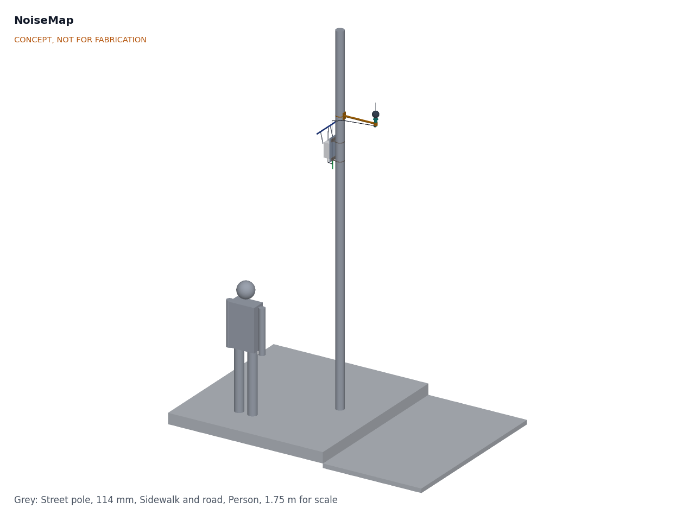
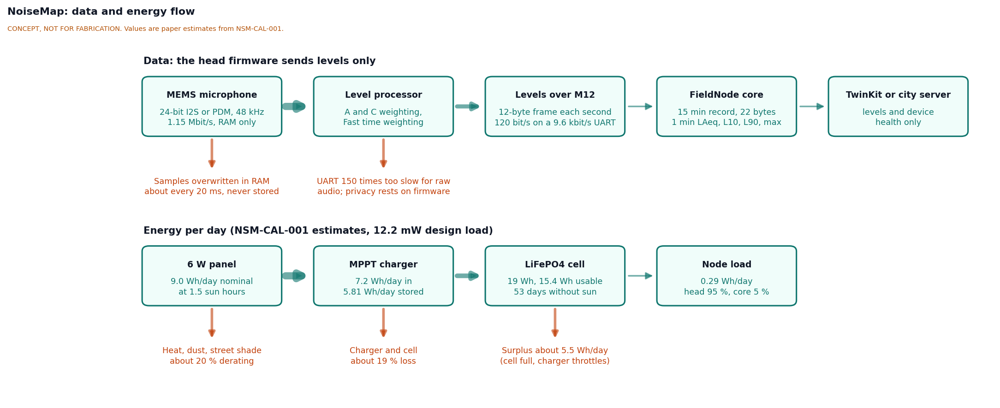
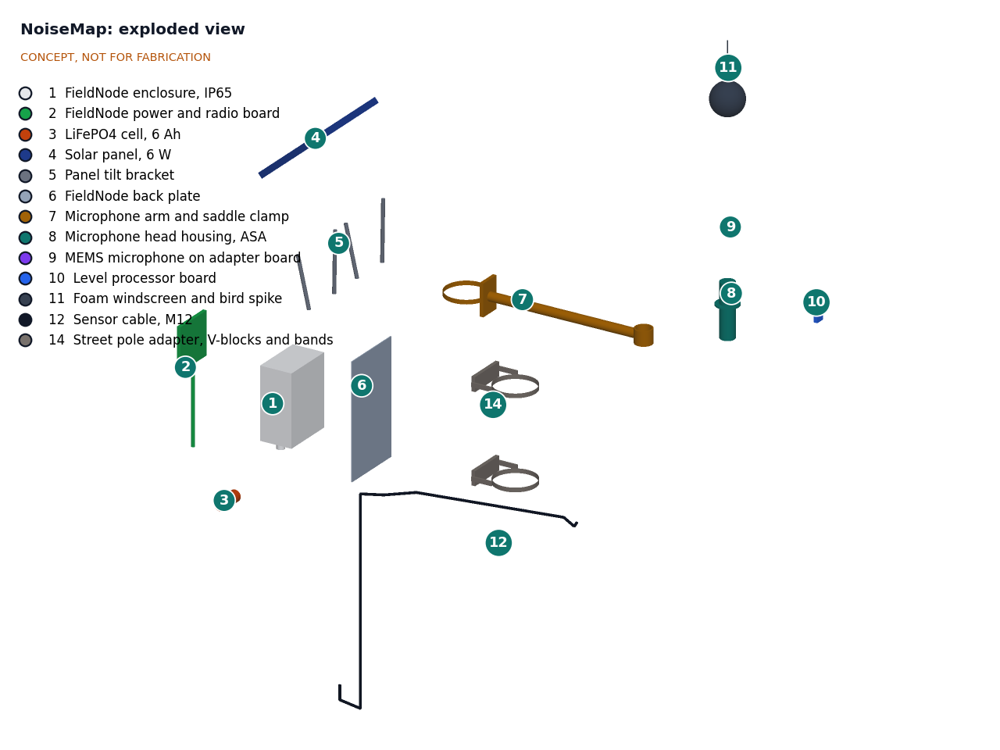
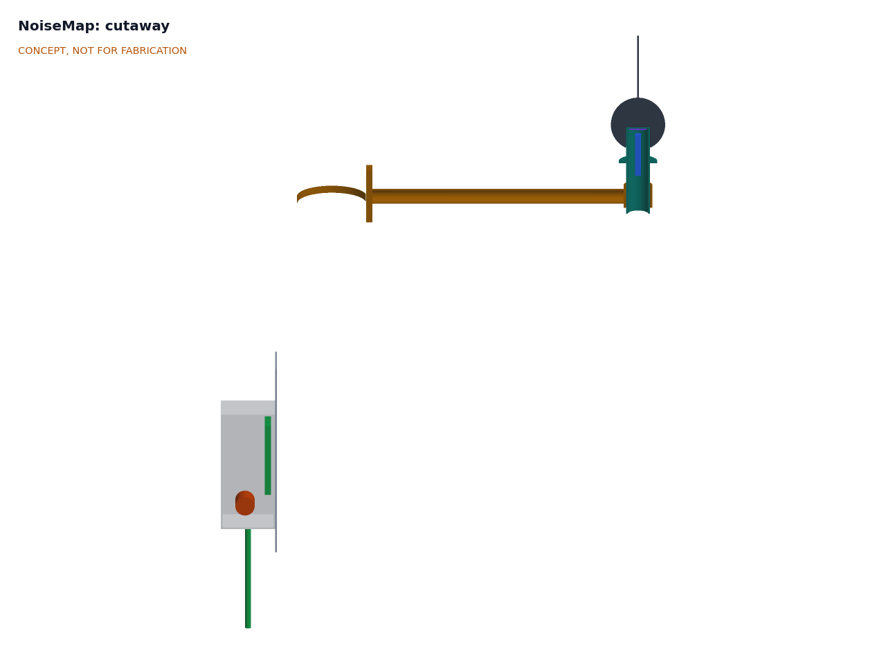

# NoiseMap design precis

NoiseMap is a clamp-on street pole noise node. A digital MEMS microphone 4.0 m above the sidewalk feeds a small processor in the microphone head, which turns the sound into A- and C-weighted levels once a second and overwrites the audio within milliseconds. Only levels cross the cable to a standard FieldNode core, which sends a 22-byte record every 15 minutes over LoRaWAN. The TRL 3 calculations (NSM-CAL-001) give a design load of 12.2 mW, 53 days without sun and a range of 34.9 to 113 dBA (27.9 dBA with the IM72D128 microphone). The NoiseMap parts cost $62.00 against the $100 budget, which now covers them alone; a full node with the $126.00 FieldNode core is $188.00. The node weighs 3.32 kg, over the 3 kg of R10.

## How it works

1. **Sense.** The MEMS microphone, port facing up under the head's acoustic port and inside a foam windscreen, streams 24-bit samples at 48 kHz to the level processor, over I²S from an ICS-43434 or PDM from an IM72D128.
2. **Weight and integrate.** The processor applies A and C weighting, a low-frequency equalizer for the microphone roll-off and a Z-weighted wind band below 40 Hz as digital filters, then computes each second LAeq,1s, the Fast time-weighted maximum and minimum (LAFmax, LAFmin), LCeq,1s and the wind band level. Samples live in a small RAM buffer that is overwritten about every 20 ms. The load is about 13 % of a 48 MHz core.
3. **Hand over levels only.** Once a second the head sends a 12-byte frame to the FieldNode core over a 9,600 baud UART in the M12 cable. The head has no data storage and no radio.
4. **Summarize.** The FieldNode core builds a 15-minute record: fifteen 1-minute LAeq values, the 15-minute LAeq, LAFmax and LAFmin, L10 and L90 (from the 900 one-second values), LCeq and a status byte with the wind flag, 22 bytes in all.
5. **Send.** The core sends each record over LoRaWAN to the lab's TwinKit gateway, a city server or The Things Network, and stores it in flash with a time stamp if the link is down. Night indicators (Lnight, Lden) and the rain flag are computed on the server.

## Main components

Table 1. Main components. Numbers match the exploded view (Figure 3), `cad/src/model.py` and `bom/bom.csv`. Lines 1 to 6 are the FieldNode core, costed in the FieldNode repo.

| # | Component | Choice | Notes |
| --- | --- | --- | --- |
| 1 | FieldNode enclosure | IP65 polycarbonate box 150 x 90 x 200 mm with vent and glands | From FieldNode, unchanged |
| 2 | FieldNode power and radio board | MPPT charger with cold-charge lockout, STM32WL-class LoRaWAN module, SPI flash, whip antenna, two M12 ports | From FieldNode, unchanged |
| 3 | LiFePO4 cell | One 3.2 V, 6 Ah cell | FieldNode standard; 53 days at the NoiseMap load |
| 4 | Solar panel | 6 W, 290 x 200 mm, 40° tilt, doubling as a hood | FieldNode standard |
| 5 | Panel tilt bracket | Flat-bar posts and struts | From FieldNode |
| 6 | FieldNode pole mounting kit | Back plate 180 x 320 x 3 mm | Only the plate is used on street poles |
| 7 | Microphone arm | 25 x 2 mm aluminum tube, 422 mm, saddle plate and its own band clamp | Puts the microphone 0.45 m from the pole face; turns independently of the core |
| 8 | Microphone head housing | Printed ASA tube 40 mm OD x 150 mm, 3 mm acoustic port, drip skirt, hydrophobic membrane | NSM-DDR-001 D13 |
| 9 | MEMS microphone | Adapter board for an ICS-43434 (I²S, 65 dB SNR, [TDK InvenSense](https://invensense.tdk.com/products/ics-43434/)) or an IM72D128 (PDM, 72 dB(A) SNR, [DNMS](https://github.com/hbitter/DNMS)) | D3; the ICS-43434 is listed end of life |
| 10 | Level processor | Cortex-M4F class low-power board (STM32L4 class) with I²S and PDM inputs and read-out protection | D4 |
| 11 | Windscreen and bird spike | 90 mm open-cell foam ball bored 41 mm, stainless spike | Replace about yearly (estimate) |
| 12 | Sensor cable | M12 5-pin, about 1.5 m, 3.3 V, ground and UART | FieldNode port; pinout follows FieldNode O2 |
| 14 | Street pole adapter | Two 90° aluminum V-blocks 110 x 60 x 40 mm and two long stainless bands | Seats 60 to 140 mm poles; replaces FieldNode's 40 to 60 mm V-blocks |

Line 13 of the BOM (fasteners, safety lanyard, ties, tape) has no callout.

The general arrangement is drawing NSM-DWG-001 Rev P1 (`cad/drawings/NSM-DWG-001.pdf`), generated from `cad/src/model.py`, which also exports STEP and STL files in `cad/step/` and `cad/stl/`.

## Key numbers

All values come from NSM-CAL-001 and are paper estimates.

Table 2. Key numbers.

| Quantity | Value | Requirement |
| --- | --- | --- |
| Microphone self-noise | 29.0 dBA (ICS-43434); 22.0 dBA (IM72D128) | |
| Measuring range | 34.9 to 113 dBA (ICS-43434); 27.9 to 113 dBA (IM72D128) | R4 at risk |
| Response at 63 Hz | -2.8 dB before equalizing; ±0.8 dB after, with ±20 % corner spread | R5 at risk |
| Acoustic port resonance | 36.2 kHz; +0.44 dB at 8 kHz | R5 |
| Expanded uncertainty | 2.9 dB on assumed terms; facade bias up to 2.4 dB | R3 at risk |
| Processor | 132 cycles per sample, 13.2 % of 48 MHz, 2.15 mA | |
| Node load from the cell | 12.2 mW, 0.29 Wh/day (22.6 mW upper bound) | 12 % of FieldNode's 100 mW allowance |
| Harvest at 1.5 peak sun hours | 5.81 Wh/day stored | R7 met on paper |
| Autonomy | 53 days; 37 days at -20 °C | R7 met on paper |
| Record and airtime | 22 bytes; 23.7 s/day at SF9, 47.4 s/day at SF10 | R2 met; R12 at risk |
| Link capacity | UART 7,680 bit/s (150 times too slow for raw audio, enough for a speech codec) | R1 rests on firmware |
| Mass on the pole | 3.32 kg | R10 **not met** |
| Wind at 35 m/s | Arm, head and windscreen 16 N; arm stress factor 24; clamp twist factor 4.2 | R10 met on paper |
| Parts cost | NoiseMap $62.00; FieldNode core $126.00; full node $188.00 | R13 met on paper |

The accuracy of the measurement depends on the membrane, the windscreen, diffraction round the head and reflections from nearby facades, none of which can be settled on paper.

## Key design choices

All of these are adopted as recommended for TRL 3 under Amish's 2026-09-25 instruction, open for his review (NSM-DDR-001).

- **Levels, never audio (D9).** The only data that leave the microphone head are levels once a second. The head has no data storage and no radio, and the firmware has no code path that writes or sends samples.
- **Where privacy comes from (D2).** The 9,600 baud cable is 150 times too slow for raw audio, but fast enough for a speech codec such as Codec 2 (700 to 3,200 bit/s), and the radio could carry about 31 s of such speech a day under fair use. The guarantee therefore rests on open, auditable head firmware with read-out protection and a published build hash. Public copy never claims privacy "by physics".
- **Processing in the head (D4).** Keeping the audio next to the microphone means the M12 cable only ever carries levels.
- **Standard FieldNode core (D10).** At 12.2 mW the node uses 12 % of FieldNode's allowance with its standard 6 W panel and one cell, and stays in credit on the hot clear days that stop FieldNode charging.
- **Microphone 4.0 m above the sidewalk, 0.45 m from the pole, pointing up (D11).** This matches noise-mapping practice; the pole adds only 0.25 dB by reflection. The arm has its own clamp, so the core can face the equator while the arm faces the street.
- **A and C weighting (D12)** with 15-minute records and 1-minute LAeq (D5).
- **Microphone part (D3).** A small adapter board takes either the ICS-43434 or the IM72D128; the IM72D128 gives 7 dB more margin at the quiet end.
- **Field calibration (D7).** Each node is checked with a shared 94 dB, 1 kHz calibrator at install and at each windscreen change, and compared with a class 1 reference meter at one site per deployment, which also sets the site's reflection correction.
- **Public notice (D8)** on each pole saying what is measured, with a link to this repository.

## Safety

> **Safety:** Installing on a street pole is work at height next to traffic. Install only with the pole owner's permission, by trained crews, with fall protection and traffic management as local rules require. Keep clear of overhead power lines and street-light wiring, and never open a pole's electrical hatch. The node adds about 97 N of wind load at 3.5 to 4 m in a 35 m/s gust; the pole owner should confirm the pole can take it.

> **Safety:** The node contains a LiFePO4 cell of about 19 Wh. Fuse the cell, charge only within the cell maker's temperature limits (FieldNode's cold-charge lockout applies), and do not install a node with a swollen or damaged cell.

> **Safety:** A falling part from 4 m can injure people below. Fit a secondary safety lanyard to the microphone arm, tighten the bands to a stated torque (the clamp margins in NSM-CAL-001 assume 1,000 N preload), and check the clamps after the first storm.

> **Safety:** Do not test the node near its upper range with loudspeakers or calibrators at close range without hearing protection.

**Privacy.** No images, audio recordings or personal identifiers leave the device; only sound levels are stored or sent. The guarantee rests on the published head firmware and its build hash. Check local data protection law before any deployment, and put a notice on the pole saying what is measured and where the design is documented.

**Use of the data.** NoiseMap readings are indicative. They are not certified measurements and must not be presented as legal evidence without a co-located certified instrument.

## Open questions

- First co-design partner and street (NSM-DDR-001 O1). Proposed, awaiting Amish.
- Mass over R10 (O2), wind flag method (O3) and the airtime rule at SF10 and slower (O4). Proposed, awaiting Amish.
- Beyond TRL 3, on hold: measure the response of the chosen microphone in the printed head with membrane and windscreen, the windscreen insertion loss, the wind-band threshold against an anemometer, and the site reflection correction.

Concept media: [blueprint sheet](../media/concept-blueprint.pdf), [interactive 3D model](../media/viewer.html).
