# NoiseMap prototype build plan

**Plan, not yet built.** How to build the first proof-of-concept prototype, component by component. Building and testing to it is TRL 4 work. Decisions still to be made are kept in the design decisions register ([docs/06-design-decisions.md](06-design-decisions.md)), not here.

## 1. What you are building

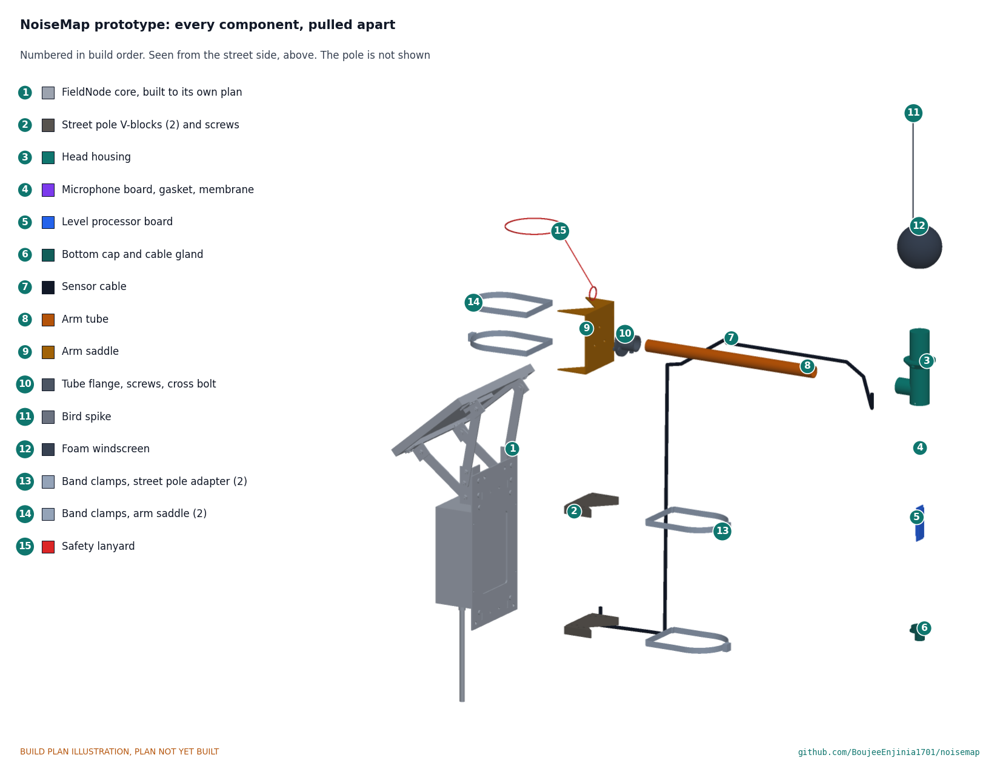

*Figure 1. Every component pulled apart and numbered in build order. The pole is not shown.*

The prototype is one NoiseMap node on a 1.2 m length of 114 mm tube standing in for a street pole: a FieldNode core (a grey box with a battery cell, a radio and a solar panel) clamped to one side of the pole, and a microphone head on a short aluminium arm clamped higher up and pointing the other way, toward the street. The head is a printed tube with a microphone under a small port in its top, a level processor board inside, and a foam ball over the top. A cable carries sound levels, never audio, from the head to the core. Figure 1 shows the 15 components in the order you make or fit them. The FieldNode core is built to its own plan (FND-BLD-001) and fitted here with two larger V-blocks in place of its own. Six components are made in a small workshop: the two V-blocks, the arm saddle (a bent aluminium sheet that a local shop can bend), the arm tube, the printed head, its printed bottom cap and the bird spike. Everything else is bought and fitted. The work is sawing, filing, drilling and tapping aluminium, cutting a thread on a stainless rod, two 3D prints in ASA, and soldering and screwing bought boards into the head. The NoiseMap parts cost about $72 from the bill of materials; the FieldNode core is costed in its own repository.

> **Safety:** On a street the node is installed at 3.3 to 4.2 m beside traffic; that work needs the pole owner's written permission, a lift or a stable ladder with a second person, fall protection and traffic management, and must stay clear of overhead lines and of the electrical parts of a lighting pole. The FieldNode core holds a lithium iron phosphate cell of about 19 Wh: follow the cell stops in its own build plan. Cut aluminium and stainless edges are sharp: deburr everything. Printing ASA gives off fumes; print in a ventilated space. Keep loudspeakers and calibrators off your ears when you test the microphone.

## 2. What changed to make it buildable

The concept showed what the node does; some of its parts could not be made or fixed as drawn. Each change below keeps what the node does, and all of them are recorded in decision record NSM-DDR-003, accepted by Amish on 2026-10-02.

*Table 1. Changes from the concept.*

| Component | The concept had | The buildable design has | Why |
| --- | --- | --- | --- |
| FieldNode core | The old FieldNode massing model | The constructable FieldNode, built to its own plan, without its small-pole V-blocks and bands | One core design for the portfolio |
| Street pole V-blocks | Blocks 110 x 60 x 40 mm with milled pockets, no fixing, bands with nowhere to go | Blocks 112 x 63 x 16 mm sawn from bar, four drilled holes, on FieldNode's own screw holes; bands under a rebate and through FieldNode's own slots (Figures 2 to 4) | Workshop tools only; no new holes in the FieldNode plate; same mass |
| Arm saddle | A milled 10 mm plate with one band and no path for it | A bent 2.5 mm sheet channel with a V in each flange and two bands through its web (Figures 5 to 7) | A bending shop can make it; it seats 60 to 140 mm poles and resists twist twice as well |
| Arm to saddle and head | A tube with no fixing at either end | A bought tube flange on the saddle and a socket printed on the head, each with a cross bolt (Figures 8, 11) | No welding |
| Inside the head | Boards floating, open bottom, no gland | Card guides, two screws and a gasket for the microphone board, a printed bottom cap with a cable gland (Figures 12 to 14) | Every part held; the front cavity the calculations use is kept |
| Drip skirt | A flat overhang | The same skirt with a 45 degree cone under it | Prints without support |
| Windscreen and bird spike | A loose foam ball; a spike with nothing holding it | The foam a push fit on the head; the spike screwed into a boss on the skirt (Figure 19) | Both stay put in wind |
| Lanyard and cable | Listed but not placed | A lanyard round the pole and the arm; the cable routed and tied (Steps 11 and 12) | Real paths and fixings |

## 3. Making the components

Make and check each component before the assembly step that needs it. Sizes are in millimetres. "Back" on a V-block is the face that goes on the FieldNode back plate; "pole end" of the arm is the end at the saddle. Workshop tolerance is 0.5 mm unless a step says otherwise; drawings do not carry tolerances before TRL 4.

### 3.1 FieldNode core (built to its own plan)

**What it is.** The standard FieldNode: enclosure, cell, electronics, radio, two sensor ports, 6 W panel and bracket on a 180 x 320 x 3 mm aluminium back plate. Build it to the FieldNode build plan, FND-BLD-001, sections 3.1 to 3.8 and steps 2 to 10, with two differences: do not make or fit its small V-blocks (FND-BLD-001 section 3.2 and step 1) or its band clamps (step 12), and leave its sun shield off.

**How it fits the parts next to it.** The street pole V-blocks screw into the four countersunk holes the FieldNode back plate already has for its own V-blocks, and the street pole bands use the plate's four band slots (Figure 3). Nothing new is drilled in the plate.

**Check before moving on.** The FieldNode build plan's own checks and safety stops pass; the cell fuse stays out until its plan says otherwise.

### 3.2 Street pole V-blocks (make 2)

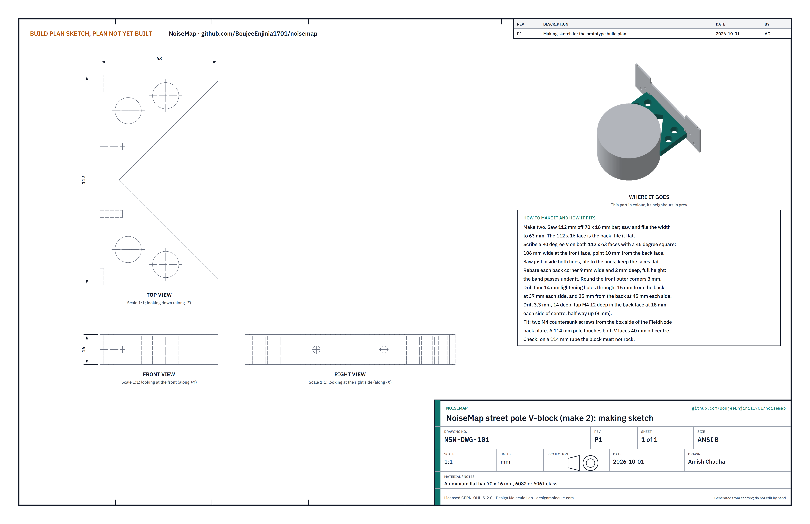

*Figure 2. Street pole V-block making sketch (NSM-DWG-101).*

**What it is and what it is made from.** A block with a V cut in it that the street pole sits in, one at each band. Aluminium flat bar 70 x 16 mm, 6082 or 6061 class.

**How to make it.**

1. Saw a 112 mm length off the bar for each block. Saw and file the width from 70 to 63. The 112 x 16 face on one long edge is the back; file it flat.
2. On both 112 x 63 faces, scribe the V with a 45° square: 106 wide at the front face, meeting at a point 10 from the back face, centred on the length.
3. Saw just inside both lines and file to them. Keep the two V faces flat and square to the block's faces.
4. At each back corner, file a rebate 9 wide and 2 deep, the full 16 height. The band runs under it.
5. Round the two front outer corners to about 3 mm and break the V's front edges by 0.5 mm so they cannot scratch the pole.
6. Drill four 14 mm lightening holes straight through: two 15 from the back face at 37 each side of centre, and two 35 from the back face at 45 each side of centre.
7. In the back face, half way up (8 from an edge), 18 each side of centre: drill 3.3 mm 14 deep and tap M4 12 deep.

**How it fits the parts next to it.**

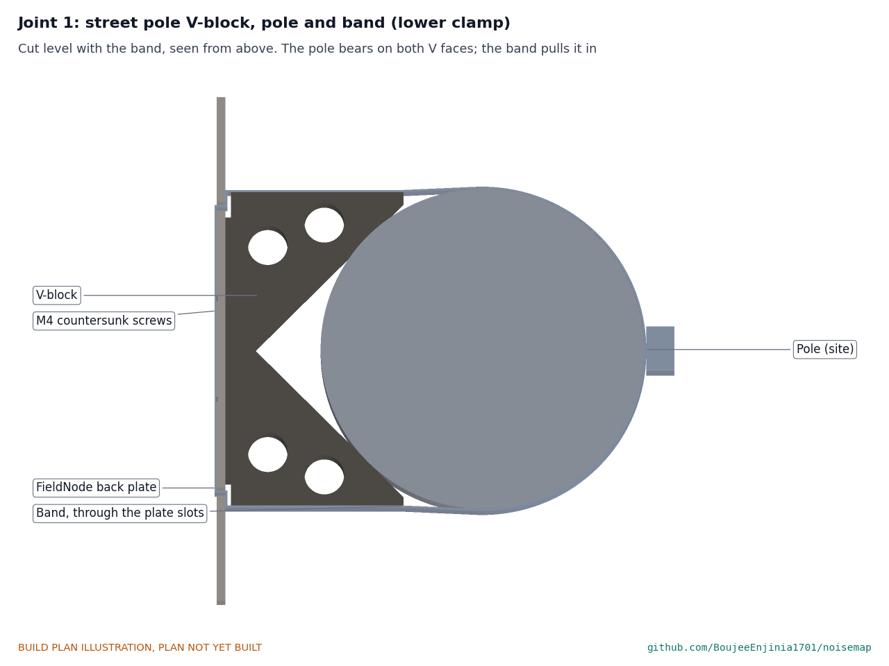

*Figure 3. The pole sits in the V and touches both faces; the band goes round the pole and pulls it into the V.*

The back face sits flat on the pole side of the FieldNode back plate, centred on the plate, one block on each band height (20 and 270 up from the plate's bottom edge). Two M4 x 12 countersunk screws go in from the box side of the plate into the tapped holes, with a drop of medium threadlocker. A 114 mm pole touches both V faces 40 mm each side of centre, about 13 mm in from the front face; poles from 60 to 140 mm also seat on both faces.

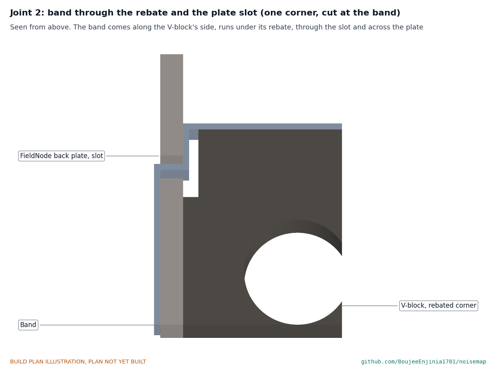

*Figure 4. Each band comes along the side of the block, runs under the rebate, passes through the plate's band slot and crosses the box side of the plate.*

**Check before moving on.** Hold a block against a 114 mm tube: it must not rock, and light shows at the bottom of the V but not along its faces. Screw it to the plate: it sits flat with the screw heads flush on the box side.

### 3.3 Arm saddle

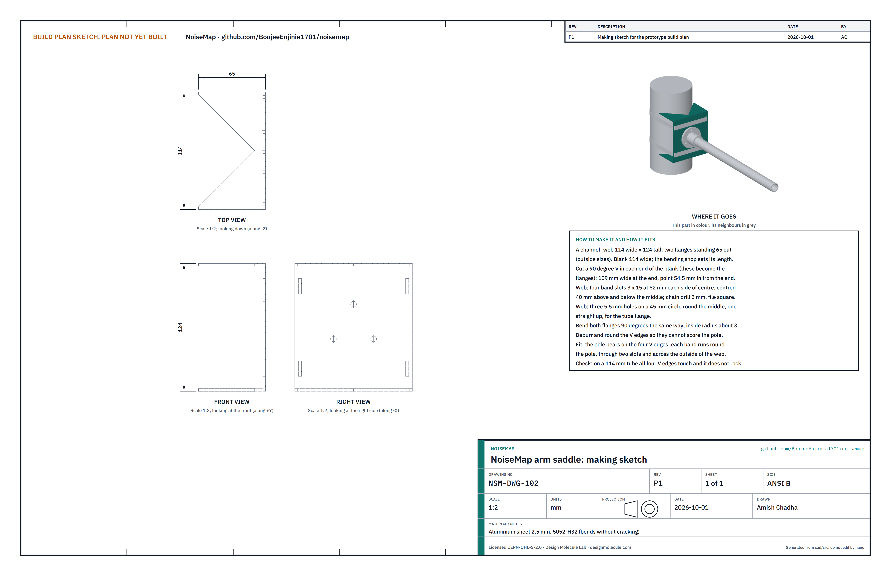

*Figure 5. Arm saddle making sketch (NSM-DWG-102).*

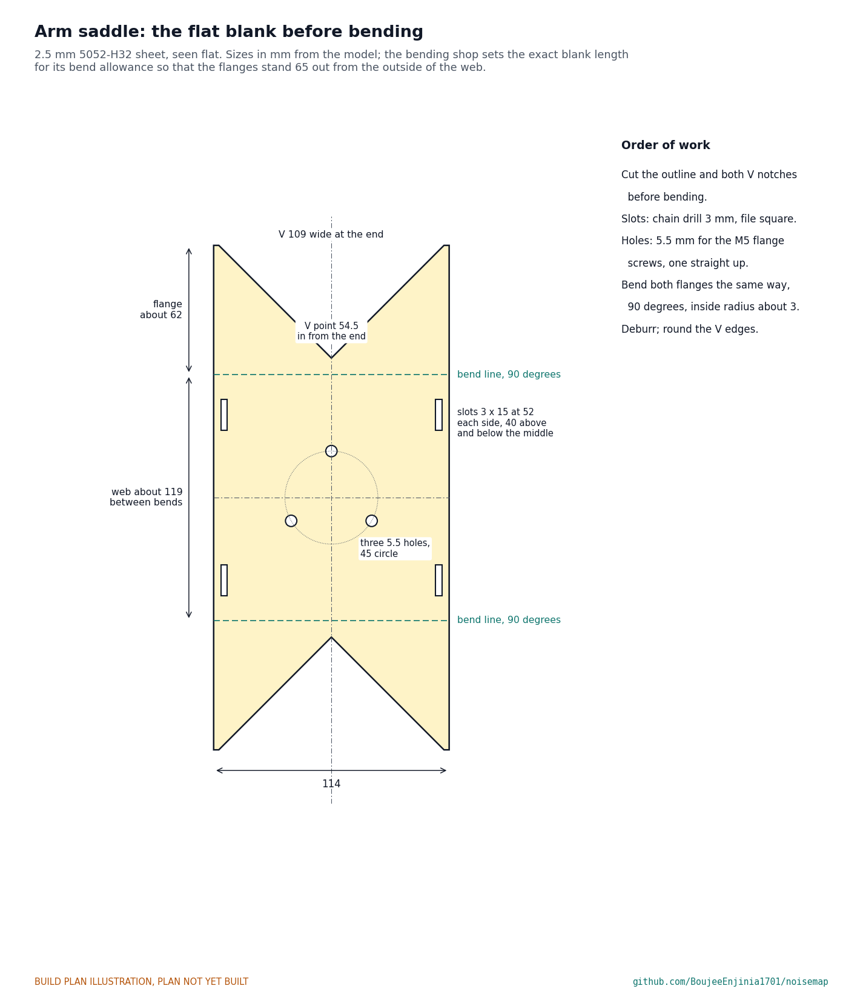

*Figure 6. The flat blank with every cut and hole, measured from the centre lines.*

**What it is and what it is made from.** The bracket that the arm bolts to and that two bands pull against the pole. Aluminium sheet 2.5 mm, 5052-H32 (it bends without cracking), bent into a channel 114 wide, 124 tall and 65 deep.

**How to make it.**

1. Cut a blank 114 wide. Ask the bending shop for its length for their bend allowance: the web must be 124 outside, and each flange must stand 65 out from the web's outer face. About 243 is a starting figure.
2. At each end of the blank (these become the flanges) mark a 90° V centred on the width: 109 wide at the end, its point 54.5 in from the end. Cut with snips or a jigsaw and file to the lines.
3. On the web, mark the centre (Figure 6). Cut four band slots 3 wide and 15 tall, 52 each side of the centre line, centred 40 above and 40 below the centre: chain drill 3 mm and file square.
4. Drill three 5.5 mm holes on a 45 mm circle round the centre, one straight up toward a flange and the other two 120° from it. Check them against the tube flange you bought before drilling (section 3.9).
5. Bend both flanges 90° the same way, inside radius about 3.
6. Deburr every edge and hole. Round the V edges with a file so they cannot score a galvanised pole.

**How it fits the parts next to it.**

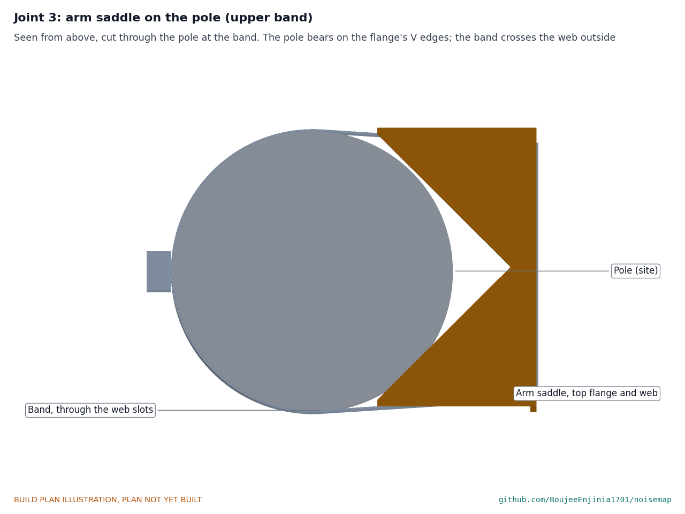

*Figure 7. The pole bears on the V edges of both flanges; each band runs round the pole, through two slots and across the outside of the web.*

The flanges point at the pole and the web faces the street. A 114 mm pole touches each V 40 mm each side of centre; a 140 mm pole 49.5 mm, still 5 mm inside the mouth. The tube flange sits on the outside of the web between the two bands, 4 mm clear of each.

**Check before moving on.** On a 114 mm tube all four V edges touch and the saddle does not rock; the web is square to the tube.

### 3.4 Arm tube

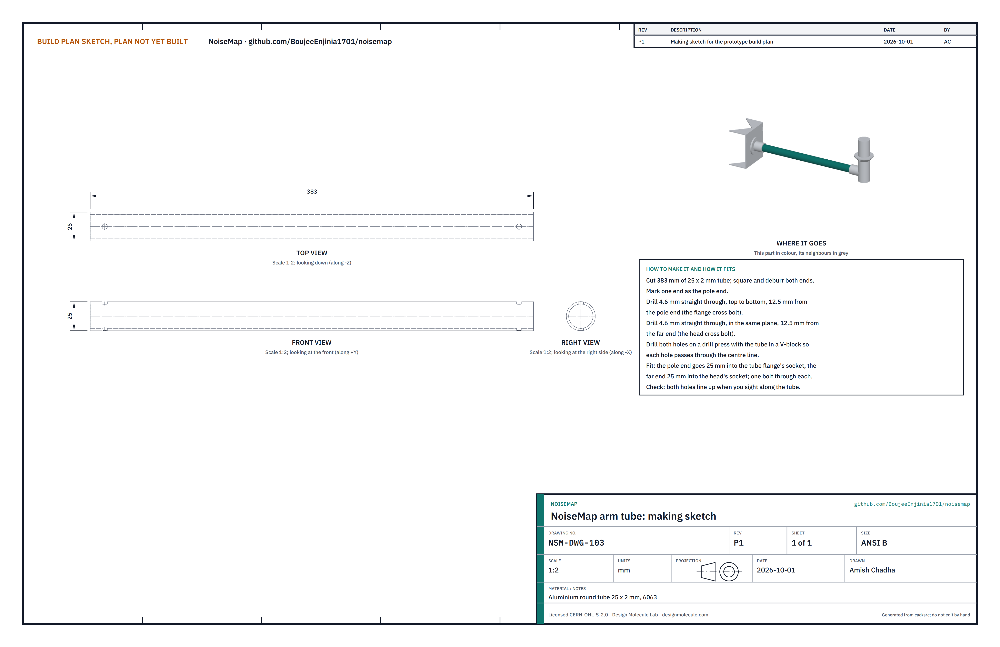

*Figure 8. Arm tube making sketch (NSM-DWG-103).*

**What it is and what it is made from.** The arm that holds the head 0.45 m out from the pole face. Aluminium round tube 25 x 2 mm, 6063.

**How to make it.**

1. Cut 383 of tube; square and deburr both ends. Mark one end "pole".
2. On a drill press, with the tube in a V-block, drill a 4.6 mm hole straight through on the centre line 12.5 from the pole end, and another 12.5 from the far end, both in the same plane.

**How it fits the parts next to it.**

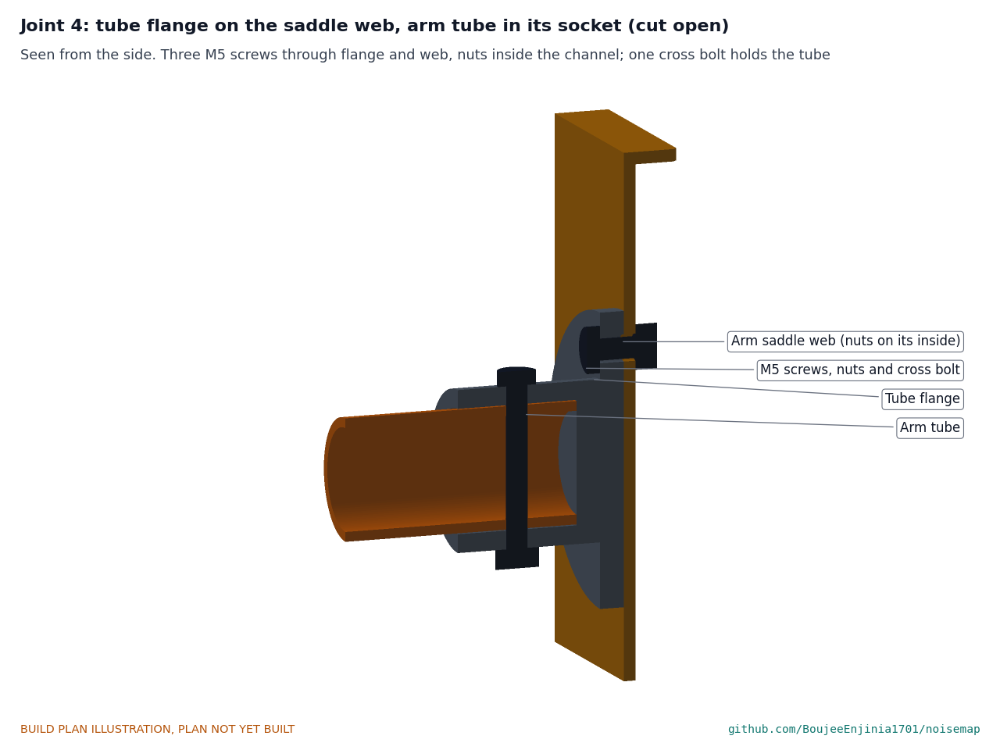

*Figure 9. Three M5 screws hold the flange to the web, nuts inside the channel; the tube goes 25 mm into the socket and one M5 bolt passes through both.*

The pole end goes to the bottom of the tube flange's socket with its hole lined up with the hole you drill in the socket (section 3.9); the far end goes to the bottom of the head's socket (Figure 11).

**Check before moving on.** Sight along the tube: the two holes line up.

### 3.5 Head housing

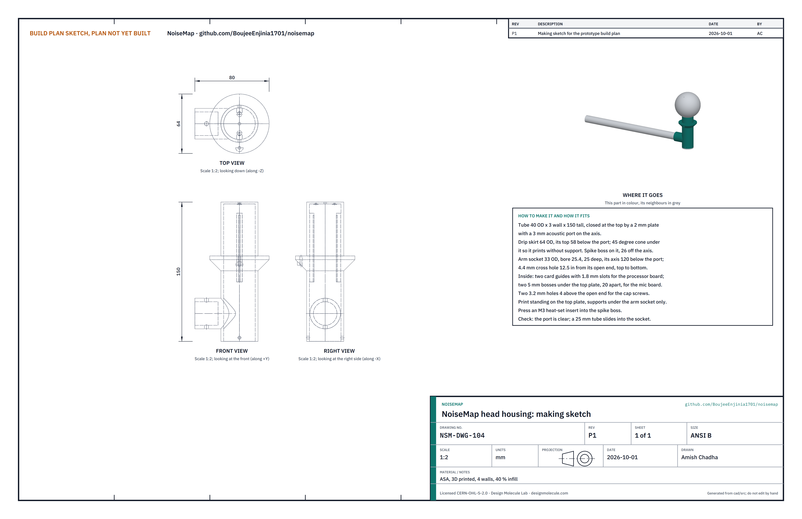

*Figure 10. Head housing making sketch (NSM-DWG-104).*

**What it is and what it is made from.** The printed tube that carries the microphone at its top, the processor inside, the windscreen and spike outside, and the arm socket on its side. ASA, printed with 4 walls and 40 % infill in an enclosed printer.

**How to make it.**

1. Print it standing on its top plate, with supports under the arm socket only. It is a tube 40 OD with a 3 wall, 150 tall, closed at the top by a 2 mm plate with a 3 mm acoustic port on the axis. A 64 mm drip skirt sits 58 below the port, with a 45° cone under it and a spike boss on it 26 from the axis. Inside are two card guides with 1.8 mm slots and two 5 mm bosses under the top plate, 20 apart.
2. Let it cool on the bed. Clear the port with a 3 mm drill turned by hand; it must be round and open.
3. Open the arm socket's cross hole to 4.4 mm and the two cap screw holes, 4 above the open end, to 3.2 mm.
4. Press an M3 heat-set insert into the spike boss with a soldering iron, square to the skirt.

**How it fits the parts next to it.**

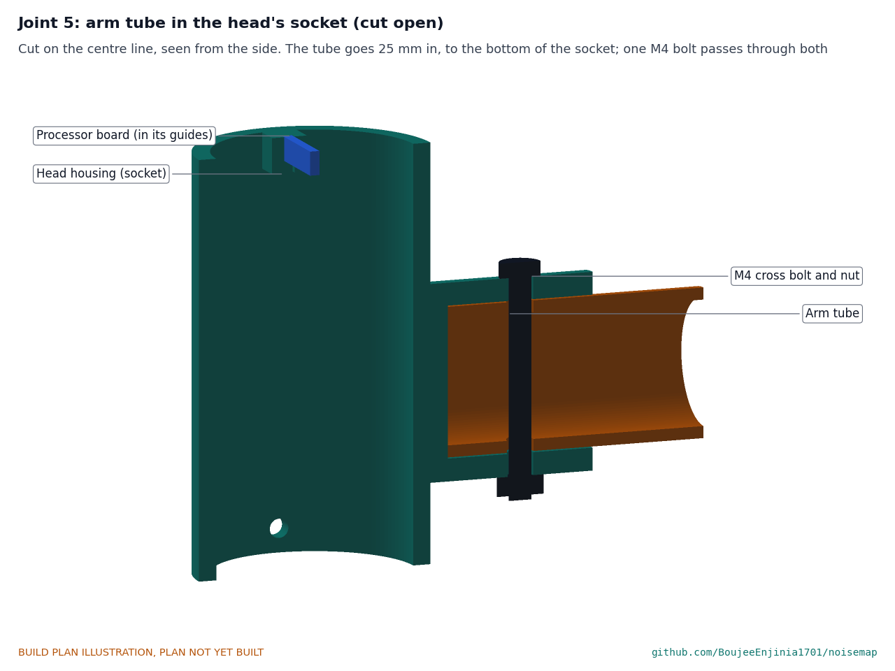

*Figure 11. The tube goes to the bottom of the 25 mm socket, 120 below the port, and one M4 bolt passes through both.*

**Check before moving on.** The port is clear; a 25 mm tube slides into the socket to the bottom; light shows straight through the port.

### 3.6 Microphone board, gasket and membrane (bought, fitted into the head)

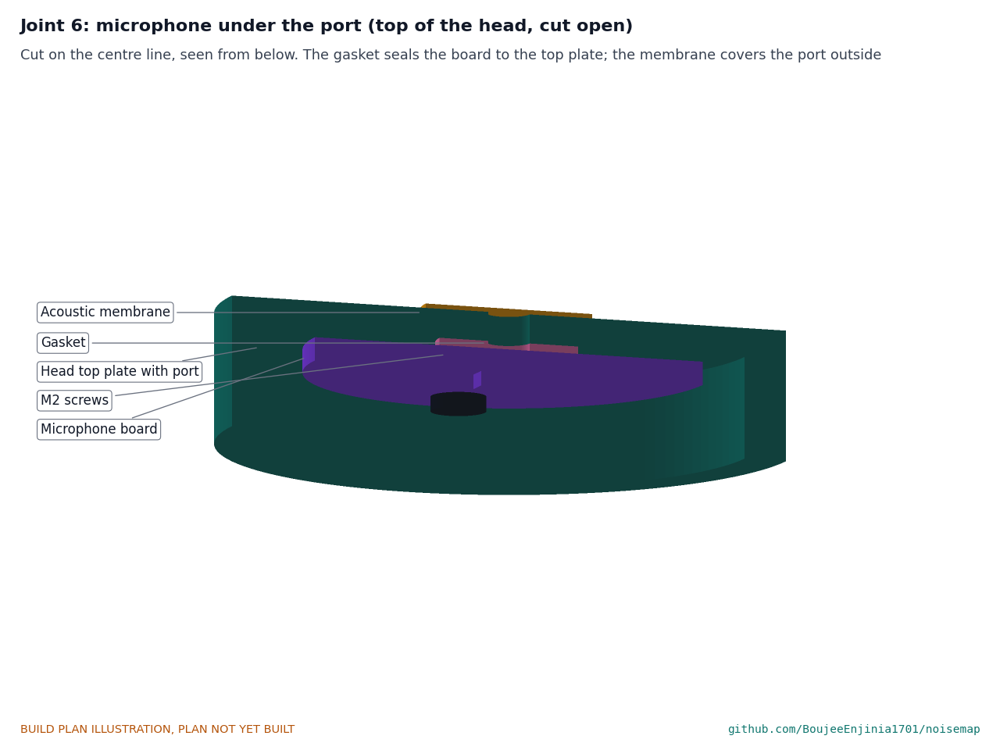

*Figure 12. The board sits on its two bosses, 0.5 mm under the top plate; the gasket ring round the port seals it, so the sound path is the port and the small space inside the gasket. The membrane covers the port outside.*

**What it is.** A 28 mm round adapter board with a bottom-port MEMS microphone (an ICS-43434 or an IM72D128) mounted underneath, its sound hole facing up through the board; a 0.5 mm closed-cell gasket ring 10 OD with a 3 mm hole; and a hydrophobic acoustic membrane about 12 mm across.

**How to fit it.** Stick the gasket on the board, centred on the board's sound hole. Push the board up the open end of the head, microphone side down, onto the two bosses, with the sound hole under the port. Fix it with two M2 x 3 screws. Stick the membrane over the port outside, pressing it flat with no creases.

**Check before moving on.** Looking down the port with a light below, you see the board's sound hole; the board does not move.

### 3.7 Level processor board and wiring

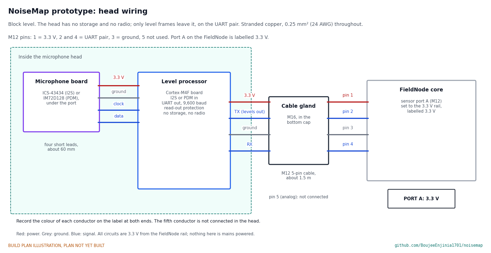

*Figure 13. Block-level wiring of the head.*

**What it is.** A Cortex-M4F class low-power board (STM32L4 class) with an I2S or PDM input, a UART and read-out protection, no storage and no radio, at most 26 wide and 70 long.

**How to fit it.** Solder four short leads (about 60, 0.25 mm²) from the microphone board to the processor board: 3.3 V, ground, clock and data. Slide the processor board up the card guides, components facing away from the arm socket, until it stops 12 below the top plate. A dab of neutral-cure silicone at the bottom of each guide holds it. Load the open, published head firmware and record its build hash before the board goes in.

**Check before moving on.** No lead is pinched; the board does not touch the microphone board.

### 3.8 Bottom cap, cable gland and sensor cable

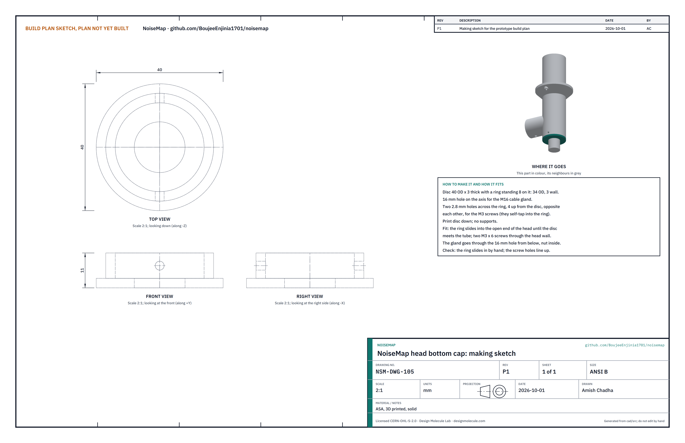

*Figure 14. Bottom cap making sketch (NSM-DWG-105).*

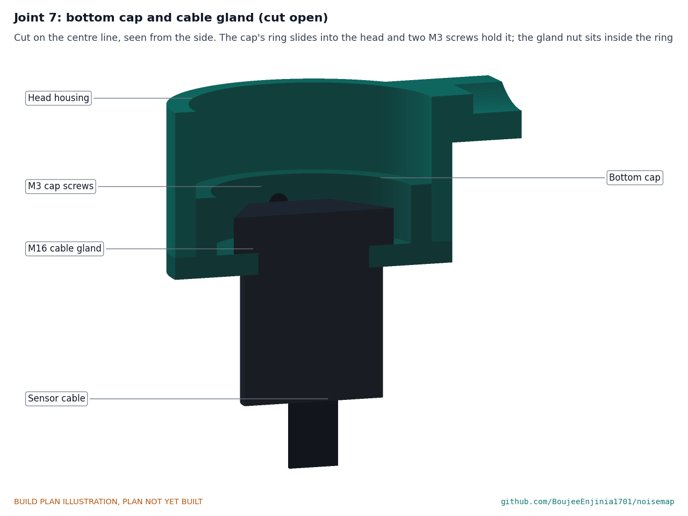

*Figure 15. The cap's ring slides into the open end of the head and two M3 screws through the wall hold it; the gland nut sits inside the ring.*

**What it is and what it is made from.** The cap is printed ASA, solid: a disc 40 OD x 3 with a ring 34 OD, 3 wall and 8 tall standing on it, a 16 mm hole on the axis and two 2.8 mm holes across the ring, 4 up from the disc. The gland is an M16 nylon cable gland for 4 to 8 mm cable. The cable is a sealed M12 5-pin cable about 1.5 m long with a plug on one end.

**How to make and fit it.**

1. Print the cap disc down, without supports.
2. Fit the gland through the cap's hole from below, nut inside the ring.
3. Pass the cable's open end up through the gland and the cap. Strip it and solder 3.3 V, ground, transmit and receive to the processor board (Figure 13). Write the colour of each conductor on a label at both ends; the fifth conductor is not used in the head.
4. Push the cap's ring into the head, lining up the screw holes, and fit two M3 x 6 screws through the wall into the ring. Tighten the gland on the cable.

**Check before moving on.** The cap sits flat against the end of the head; the cable cannot be pulled through the gland by hand.

### 3.9 Tube flange (bought, drilled)

**What it is.** An aluminium tube flange of the kind sold for 25 mm railings: a base disc about 60 across with three holes, and a socket for a 25 mm tube with a set screw.

**What to do to it.** Check that its three holes fall on a 45 mm circle; if not, drill the saddle web to match the flange. Drill a 4.6 mm hole straight through its socket, 12.5 from the socket's open end, square to the base, so that it lines up with the hole in the tube (Figure 9).

### 3.10 Bird spike and windscreen

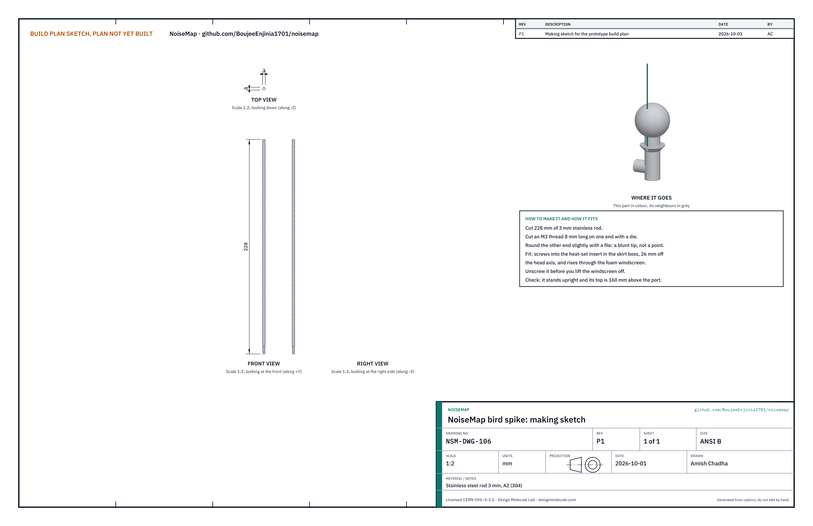

*Figure 16. Bird spike making sketch (NSM-DWG-106).*

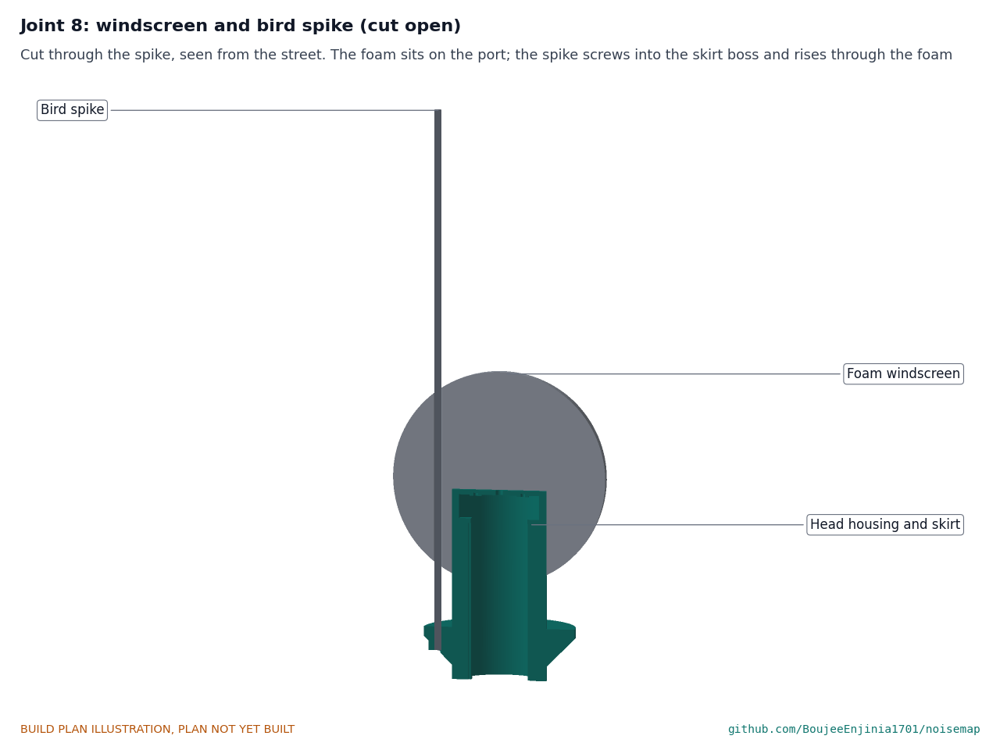

*Figure 17. The foam is pushed over the head until it sits on the port; the spike screws into the boss on the skirt and rises through the foam.*

**What it is and what it is made from.** The spike is 228 of 3 mm stainless rod (A2, 304) with an M3 thread 8 long on one end. The windscreen is a 90 mm open-cell, UV-stabilised polyurethane foam ball bored 40 mm to the centre, as sold for outdoor sound level meters.

**How to make it.** Cut the rod, cut the thread with a die, and round the other end with a file so it is blunt. If the ball is not bored, bore it 40 mm to just past its centre with a sharpened 40 mm tube turned by hand.

**How it fits the parts next to it.** The foam pushes down over the head until the bore's end sits on the membrane. The spike goes down through the foam, 26 off the axis, and screws into the insert by hand. Its top stands about 160 above the port. To lift the foam off for a calibration check, unscrew the spike first.

**Check before moving on.** The foam does not turn on the head when you twist it gently; the spike stands upright.

### 3.11 Bought components

Buy to specification, not brand. Line numbers are those of the bill of materials.

- **FieldNode core (lines 1 to 6).** As the FieldNode bill of materials.
- **Tube flange and bands (line 7).** Aluminium railing floor flange for 25 mm tube; two 12 mm stainless worm-drive band clamps that close on poles from 60 to 140 mm (bands about 370 to 560 mm), for the arm saddle.
- **Head parts (line 8).** Hydrophobic acoustic membrane about 12 mm, from an acoustic vent maker; two M3 heat-set inserts (one spare for the spike boss is wise).
- **Microphone board (line 9).** A 28 mm adapter board for an ICS-43434 or an IM72D128, with two 2.2 mm holes 20 apart; a 0.5 mm closed-cell gasket.
- **Level processor (line 10).** As section 3.7.
- **Windscreen and spike (line 11).** As section 3.10.
- **Sensor cable and gland (line 12).** As section 3.8.
- **Fixings and consumables (line 13).** Stainless: 4 x M4 x 12 countersunk screws (V-blocks); 3 x M5 x 16 button-head screws with nyloc nuts (flange); an M5 x 45 and an M4 x 40 bolt with nyloc nuts (cross bolts); 2 x M3 x 6 (cap); 2 x M2 x 3 (microphone board); 2 mm stainless wire rope with two thimbles and four ferrules for the lanyard; UV-stable cable ties at least 400 long; self-amalgamating tape; neutral-cure silicone; medium threadlocker.
- **Street pole bands (line 14).** Two more 12 mm stainless worm-drive band clamps for 60 to 140 mm poles.

## 4. Putting it together

In each picture the parts already fitted are grey and the part being fitted is in colour, with an arrow showing the way it goes in. Steps 1 to 8 are done on the bench; steps 9 to 12 on the pole stub held upright in a stand.

### Step 1: street pole V-blocks onto the FieldNode back plate

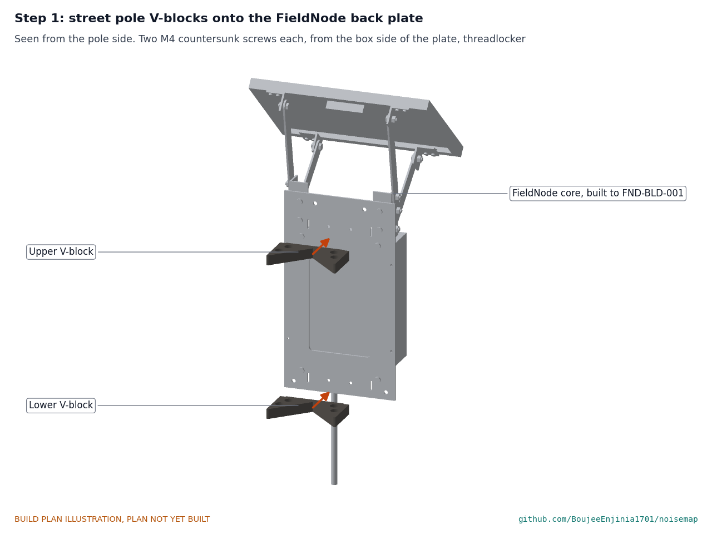

Seen from the pole side. Two M4 countersunk screws per block from the box side of the plate, with threadlocker, snug. The V opens away from the plate.

### Step 2: microphone board and membrane

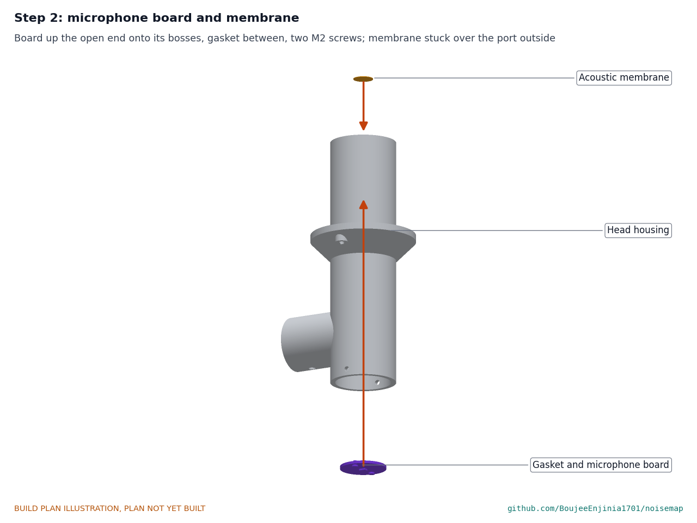

Gasket on the board, board up the open end onto its bosses, two M2 screws; membrane over the port outside (section 3.6).

### Step 3: processor board into the card guides

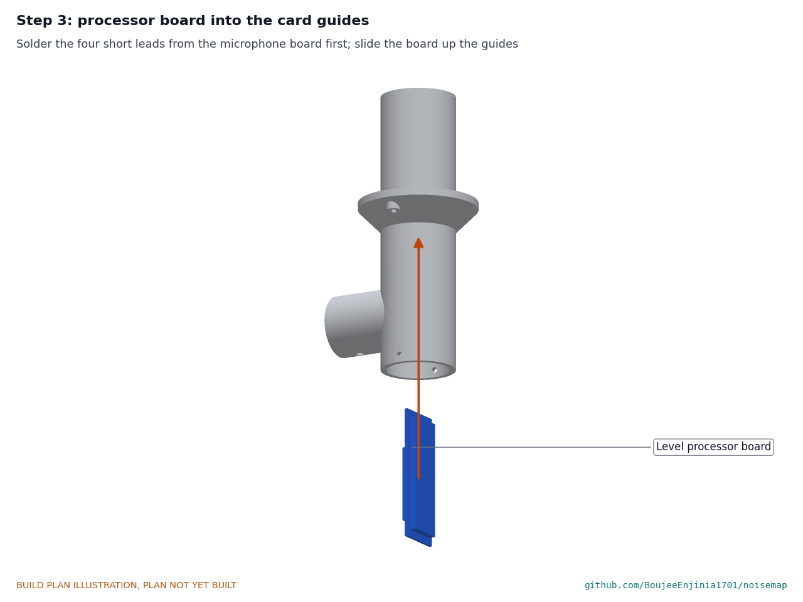

Solder the four leads from the microphone board first, then slide the board up the guides (section 3.7).

### Step 4: cable through the gland; cap into the head

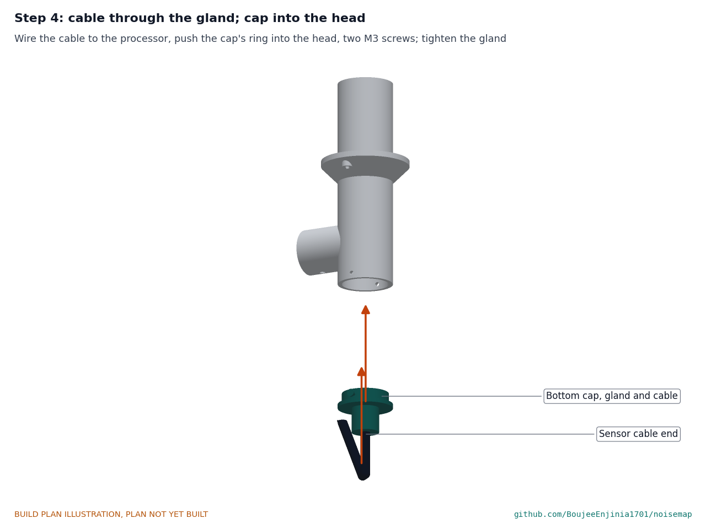

Wire the cable to the processor, push the cap's ring into the head, fit two M3 screws, tighten the gland (section 3.8). **Hold point:** the bench checks of section 5 on the head pass before going on.

### Step 5: tube flange onto the arm saddle

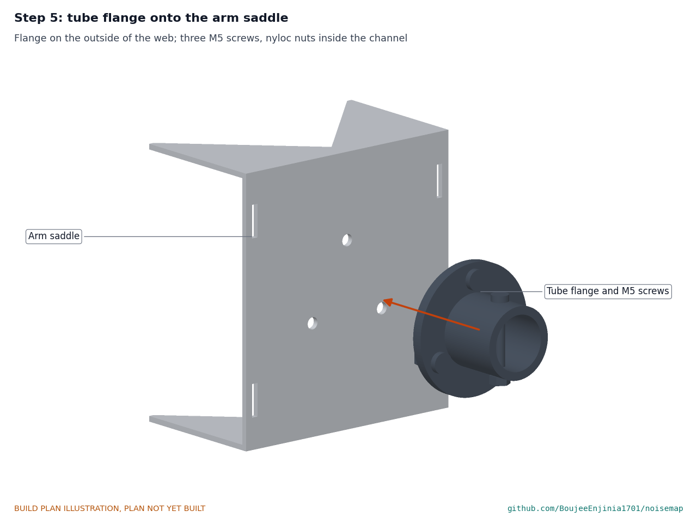

Flange on the outside of the web, centred between the band slots. Three M5 screws from the flange side, nyloc nuts inside the channel.

### Step 6: arm tube into the flange

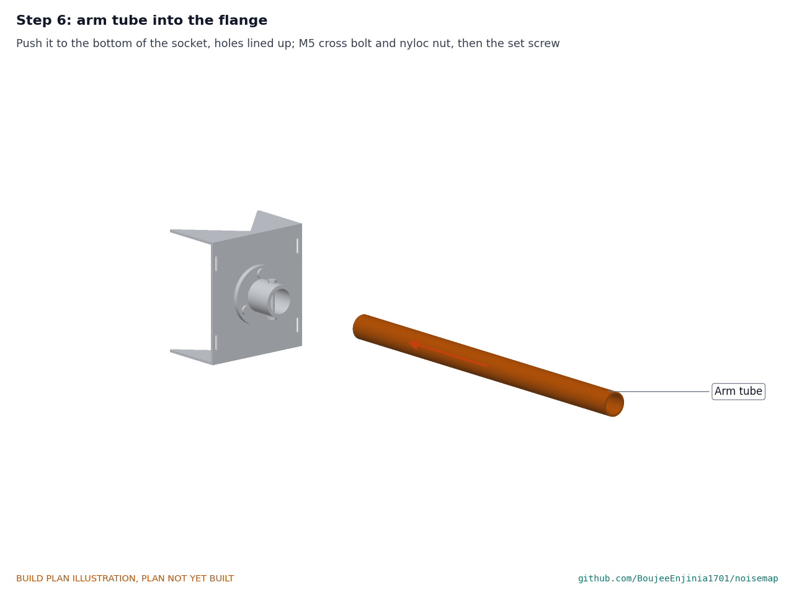

Push the pole end to the bottom of the socket with the holes lined up. M5 cross bolt and nyloc nut, then tighten the flange's set screw.

### Step 7: head onto the arm

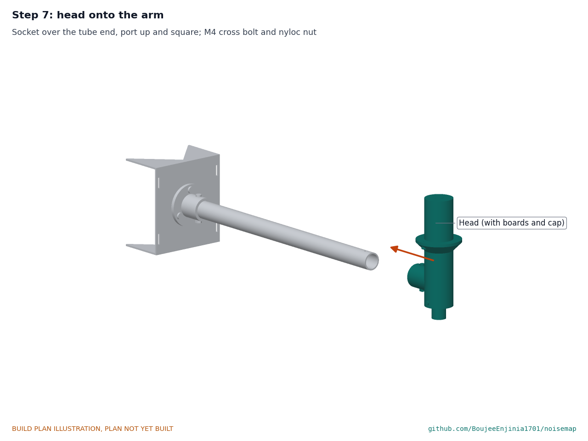

Slide the head's socket over the far end of the tube to the bottom, port up and square, the cable hanging below. M4 cross bolt and nyloc nut.

### Step 8: windscreen and bird spike

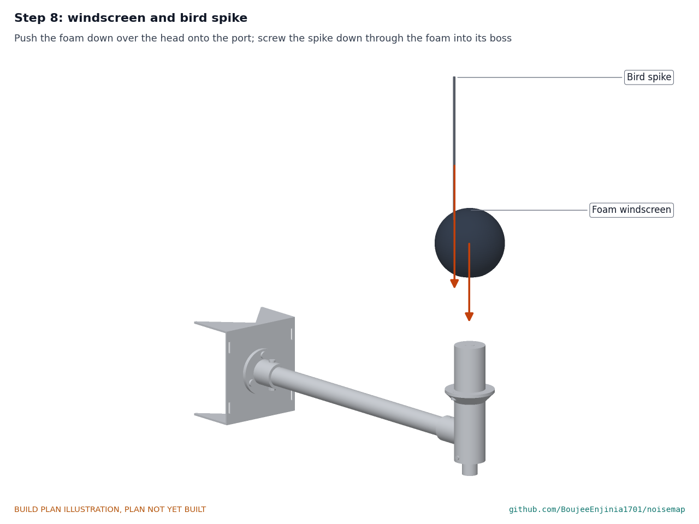

Push the foam down over the head onto the port, then screw the spike down through the foam into its insert, finger tight.

### Step 9: FieldNode core onto the pole

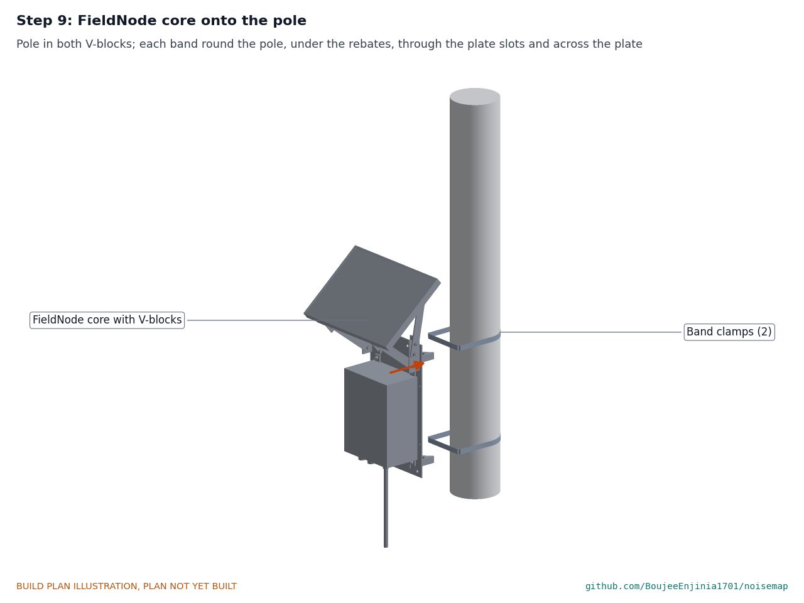

With a helper holding the core, sit the pole in both V-blocks. Pass each band round the pole, along the sides of its V-block, under the rebates, through the plate's two slots and across the box side of the plate, with the worm drive on the far side of the pole where a screwdriver reaches it. Tighten both bands to the band maker's torque and record it. **Hold point:** safety stop S2 in section 6.

### Step 10: arm saddle onto the pole

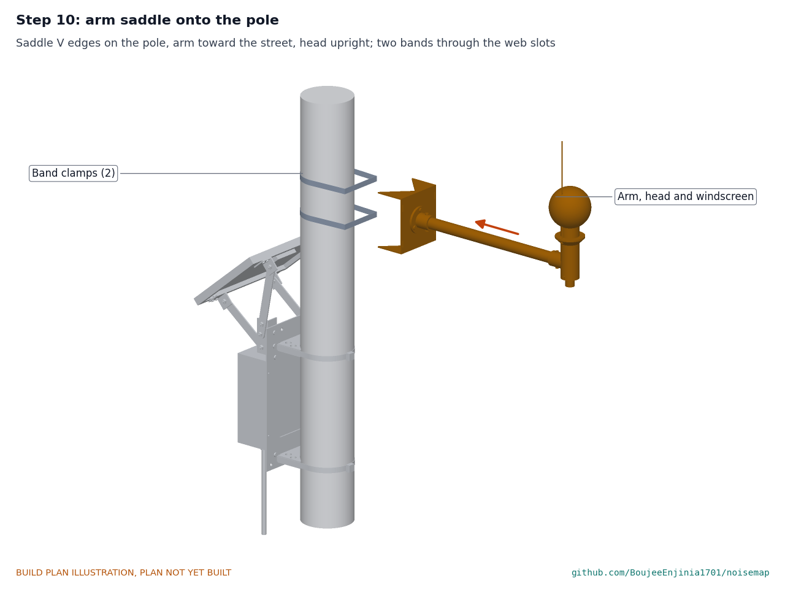

Hold the saddle's V edges on the pole above the core, the arm pointing away from the core and the head upright; on the stub, the saddle's lower flange is about 60 above the top of the panel. Pass each band round the pole, through the two web slots and across the outside of the web. Turn the arm to face the street, check the head is upright with a level, and tighten both bands to the maker's torque.

### Step 11: safety lanyard

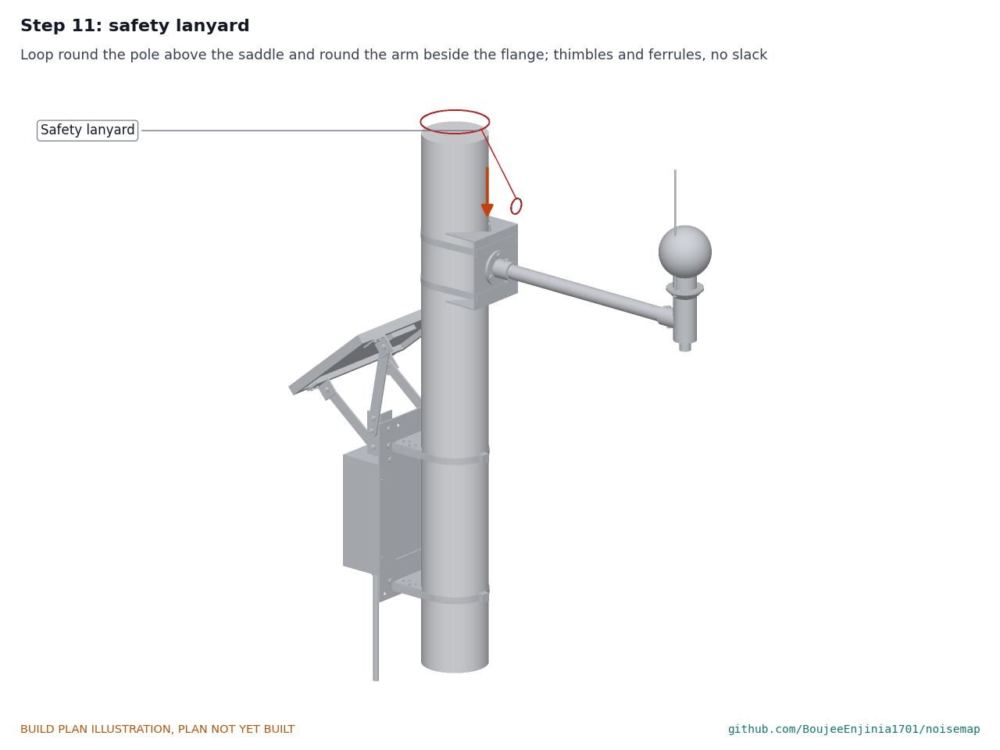

Loop the wire rope round the pole about 120 above the arm and round the arm beside the tube flange, each loop on a thimble closed with two ferrules, with no slack.

### Step 12: cable into port A and tied along

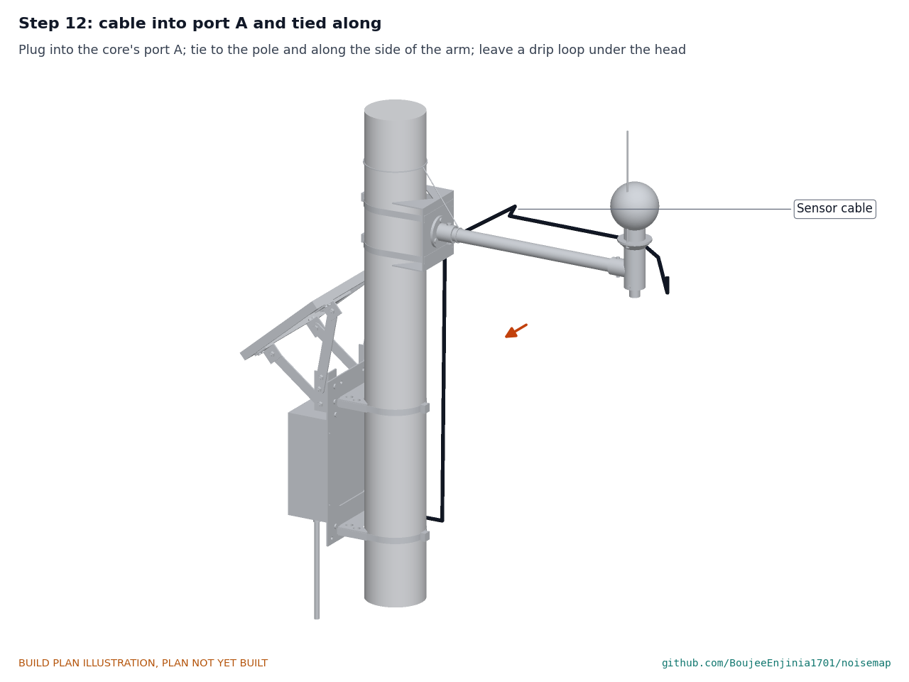

Plug the cable into the core's port A. Run it up the side of the pole away from the core, outside the saddle and along the side of the arm, and tie it every 150 or so with UV-stable ties. Leave a drip loop under the head so that rain runs off the loop, not into the gland.

## 5. First checks

These are the checks a TRL 4 test report would record; this plan only lists them. Requirement numbers are those of NSM-REQ-001.

*Table 2. First checks.*

| Check | Requirement | How | Pass when |
| --- | --- | --- | --- |
| Levels only on the cable | R1, R2 | Bench supply at 3.3 V on the cable, current limit 100 mA; watch the transmit line with a USB serial adapter | One 12-byte level frame a second and nothing else |
| Firmware build hash | R1 | Read the hash the head reports and compare it with the published build | They match; read-out protection is on |
| Microphone responds | R4 | A 94 dB, 1 kHz calibrator over the head, foam off | The head reports about 94 dB, steady |
| Port and membrane sealed | R8 | Look at the membrane and the cap under a lamp | No creases or gaps; the cap sits flat |
| Pole range | R10 | Seat the core's V-blocks and the arm saddle on 60, 114 and 140 mm tubes | Both V faces of each block and all four saddle edges touch; every band closes with adjustment to spare |
| Band torque | R10 | Torque screwdriver on each of the four bands | The maker's torque is reached without slipping; value recorded |
| Head upright and arm firm | R10 | Level on the head; push the head by hand up, down and sideways | Port level within 2°; nothing moves at any joint |
| Mass | R10 | Weigh the node, arm and head included | 3.5 kg or less (3.45 kg estimated) |
| Calibration check time | R9 | Time unscrewing the spike, lifting the foam, fitting the calibrator and refitting both | 10 minutes or less |

## 6. Safety stops

Stop at each point. Carry on only when everything listed is true.

- **S1. Before the cable is powered.** The head wiring is checked against Figure 13 with a meter; 3.3 V and ground are not swapped; the bench supply is limited to 100 mA. The FieldNode cell stays out until the FieldNode plan's own stops pass.
- **S2. Before the node goes on the pole stub.** Every screw and bolt tight with its nyloc nut or threadlocker; edges deburred; all four bands through their slots. The stub is clamped in a stand that cannot tip under the node's 3.5 kg held 0.5 m off its axis.
- **S3. Before any calibrator or loudspeaker test.** Hearing protection on; the calibrator's level is the 94 dB setting.
- **S4. Before any outdoor installation (outside this plan).** The pole owner's written permission; a lift or a stable ladder with a second person; fall protection and traffic management; clear of overhead lines and the pole's electrical hatch; the owner has checked the pole can take about 96 N of added wind load 3.5 to 4 m up; the lanyard fitted; a public notice on the pole saying what is measured.

## 7. Tools, skills and workspace

**Tools.** Hacksaw with a 24 teeth per inch blade (or a bandsaw); bench vice with soft jaws; bench drill with a V-block; drills 2.5 to 14 mm; countersink; M4 tap and tap drill; M3 die; flat and half-round files; deburring tool; scriber, engineer's square, 45° square, steel rule and calipers; tin snips or a jigsaw with a metal blade; 3D printer with an enclosure that prints ASA; soldering iron with a heat-set insert tip; wire strippers; multimeter; bench power supply with a current limit; USB serial adapter at 3.3 V; torque screwdriver covering about 1 to 6 N·m; spirit level; scale to 5 kg; stopwatch. A local bending shop bends the arm saddle.

**Skills.** No certified trade is needed. Basic metalwork (marking out, sawing, filing, drilling, tapping, threading), 3D printing, fine soldering, and loading firmware onto a microcontroller board. All circuits in the head are 3.3 V from the FieldNode; no mains wiring is part of this build.

**Workspace.** A bench about 1.2 x 0.6 m; a metalwork corner kept apart from the electronics; a ventilated place for the printer; a stand that holds a 1.2 m length of 114 mm tube upright.

**Personal protective equipment.** Safety glasses for cutting, drilling and soldering; cut-resistant gloves for bar and sheet; hearing protection when sawing and during calibrator tests; no gloves near a turning drill.

## 8. Where the numbers come from

- Model and constructability checks: `cad/src/model.py` (`python cad/src/model.py --check`), with the FieldNode core from `cad/src/fieldnode_core.py`; STEP and STL exports in `cad/step/` and `cad/stl/`.
- Pictures: `cad/src/build_plan_media.py`, using `.kit/build_views.py`; written to `docs/05-build-plan/` and `cad/drawings/NSM-DWG-101` to `NSM-DWG-106`.
- General arrangement: `cad/drawings/NSM-DWG-001.pdf`, Rev P3.
- Calculations: `docs/04-calcs/01-sizing.md` (NSM-CAL-001 v0.3) and `docs/04-calcs/sizing.py`; mass [H1], [H2], arm [H3] to [H6], pole fit [H8], cost [I1], [I2].
- Bill of materials: `bom/bom.csv`.
- Decisions: `docs/decisions/0003-design-for-construction.md` (NSM-DDR-003), with NSM-DDR-001 and NSM-DDR-002; the FieldNode core's own build plan FND-BLD-001 and decision record FND-DDR-003 in the FieldNode repository.
- Requirements: `docs/03-requirements.md` (NSM-REQ-001).
